# CSP Onboarding Permissions Preflight Check

A single Bash script you can run inside cloud shells (AWS CloudShell, Azure Cloud Shell, and Google Cloud Shell) to verify that the currently authenticated identity has the minimum permissions needed to onboard environments into Cortex Cloud.

The script is read-only: it calls IAM “introspection” APIs (AWS simulate-principal-policy, Azure role/assignment reads, GCP testIamPermissions) and prints what’s missing so you can fix it before onboarding.

## Setup

Place the script file (preflight_check.sh) in your cloud shell home directory and make it executable:
```bash
chmod +x preflight_check.sh
```

### Quickstart (Cloud Shell one-liner)
Use this in AWS CloudShell, Azure Cloud Shell, or Google Cloud Shell to download and run the latest script. It fetches `preflight_check.sh` from the main branch, makes it executable, and starts the menu.

```bash
curl -fsSLo preflight_check.sh https://raw.githubusercontent.com/PaloAltoNetworks/cc-permissions-preflight/main/preflight_check.sh && chmod +x preflight_check.sh && ./preflight_check.sh
```

## Prerequisites

Run the script from the matching cloud shell. If you run it locally, install and auth the CLIs first.

### AWS
- You are testing the same identity you will use for onboarding. For AWS Orgs, this should be tested in the master payer.
- If you're running the script in CloudShell you'll need the required permissions to do so. 
- For AWS Organization check, you must belong to the organization and have this permission: 'organizations:DescribeOrganization'

### Azure
- Set the subscription you want to test: az account set --subscription "<SUBSCRIPTION_ID>"
- The identity needs to be able to read role assignments/definitions (e.g., Microsoft.Authorization/roleAssignments/read, .../roleDefinitions/read)
 - For Azure tenant, the identity needs to be able to read roles at Entra ID level.
 - This is only to see if you have permissions to onboard Management Groups and Subscriptions from a tenant that already has the enterprise application approved.

### GCP
- Set project for project checks: gcloud config set project <PROJECT_ID>
- For org checks, know your numeric Organization ID (e.g., 123456789012)

## Usage
```bash
./preflight_check.sh
or 
bash preflight_check.sh

```
### Exit codes

- 0 – all required permissions granted
- 1 – one or more permissions are missing
- 2 – environment/setup error (not logged in, missing tools, invalid context, etc.)

## Project Structure

### A minimal layout:
```
.
├─ preflight_check.sh       # the script
```
## Menu options 
After running the script you'll be presented with the available options in which you may need to select from 1 to 7, depending on the use case.
```
=================================================================
  Preflight Permissions Check Menu 
=================================================================

Please select the Account Type:
    1) AWS Account
    2) AWS Organization
    3) Azure Subscription
    4) Azure Management Group
    5) Azure Tenant
    6) GCP Project
    4) Azure Management Group
    5) Azure Tenant
    6) GCP Project
    7) GCP Organization
Enter choice [1-7]:
```
## Content Selection

Each provider has a BASE permission set and optional feature sets. During the run, you’ll be asked whether to include additional permissions. Your answers determine the exact list that is validated.

```
Are you enabling - Event Logs?
Enter your choice of yes or no (y or n): y/n
```
For AWS, you will be asked for additional features enablement where you need more permissions to include these features.
```
Are you enabling at least one of the following features?
 - Data security posture management
 - Registry scanning
 - Serverless function scanning
Enter your choice of yes or no (y or n): y/n
```
<!-- ### AWS

- BASE: IAM, Lambda, CloudFormation, S3 core actions for baseline stacks
- AUDIT LOGS: CloudTrail, KMS, SNS/SQS, S3 bucket policies
- FEATURES: extras such as iam:PutRolePolicy for specific features -->

<!-- ### Azure

- Subscription: ARM deployments (deploy/read/delete/cancel/validate), role definition/assignment create/delete, storage & container instances create/read, etc.
- Management Group: MG-scope policy definitions/assignments, Policy Insights and remediations, managed identities (read/write), role reads/writes at MG, etc.
- Audit Logs (optional): Event Hub & Diagnostic Settings writes, relevant reads
- Azure checks compute effective Actions/DataActions minus NotActions/NotDataActions (case-insensitive wildcard matching). Management Group-level Deny Assignments are also considered.

### GCP
- Project: custom roles + service accounts create/read/setIAM; project get/getIAM/setIAM
- Organization: org/project IAM get/set; custom roles + service accounts
- Audit Logs (optional): Logging sinks, Pub/Sub topics/subscriptions, Service Usage enablement
- Uses the official testIamPermissions API to verify what your current identity has. -->

## How it Works

- AWS: Detects your principal (user/assumed-role), runs aws iam simulate-principal-policy per action, reports missing.

- Azure: Gathers your role assignments (including inherited & group-based) and the referenced role definitions, builds effective allow/deny sets, and checks required actions (case-insensitive glob). Only works for ARM onboarding option.

- GCP: Calls projects:testIamPermissions or organizations:testIamPermissions in batches; any permission not echoed back is flagged missing.

## Expected Output

### Success examples
#### AWS Account - Success Preflight Permissions Check
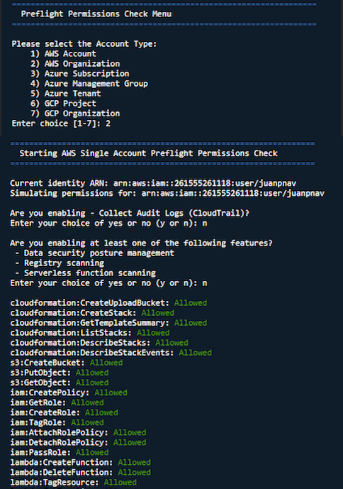
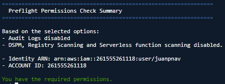

#### AWS Organization - Success Preflight Permissions Check
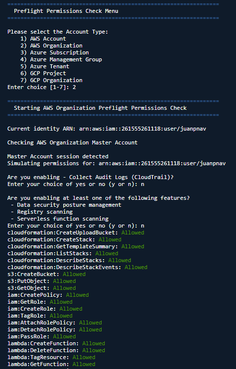
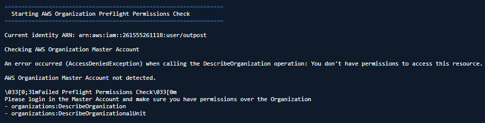

#### GCP Project - Success Preflight Permissions Check
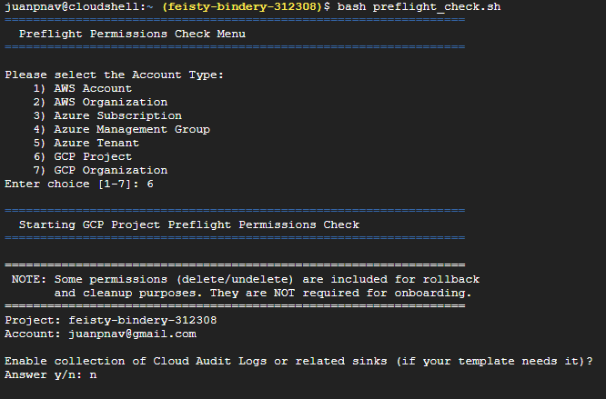
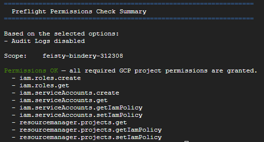

#### GCP Organizations - Success Preflight Permissions Check
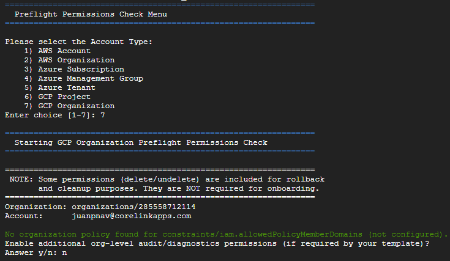
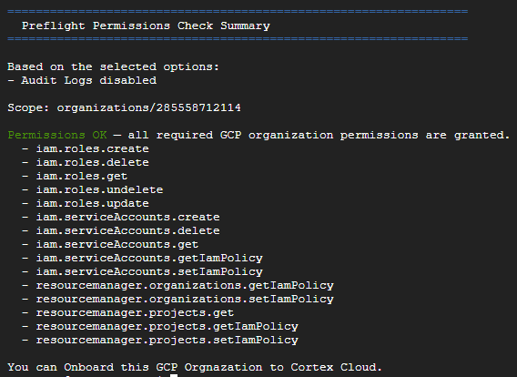

#### Azure Subscription - Success Preflight Permissions Check
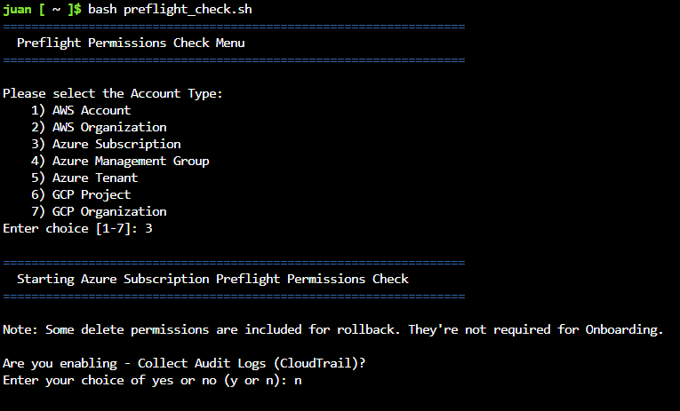
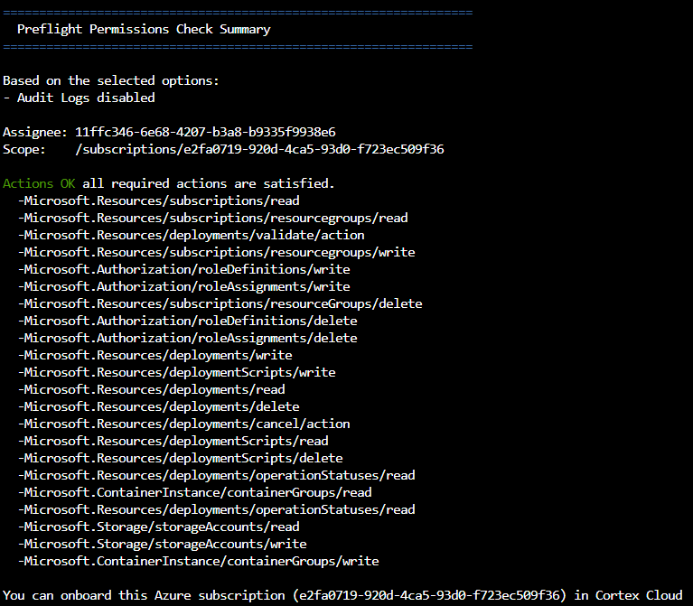

#### Azure Management - Success Preflight Permissions Check
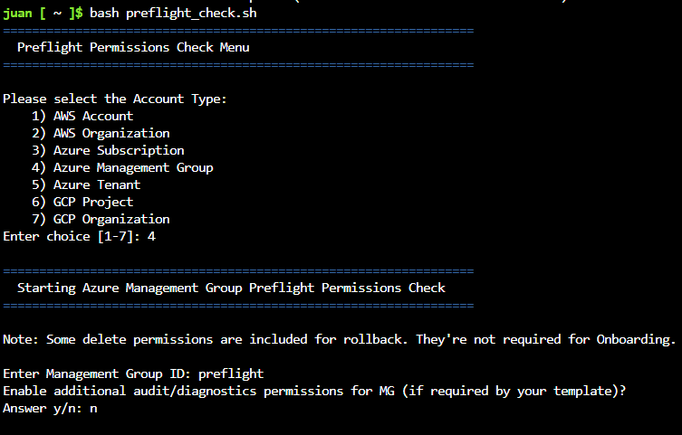
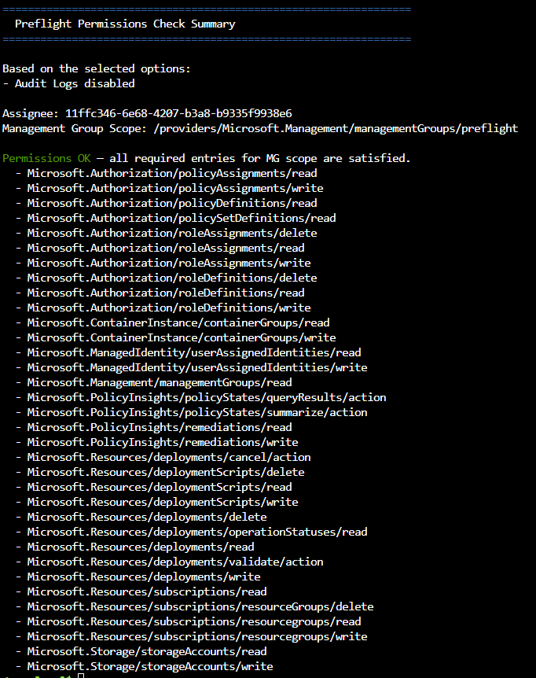

#### Azure Tenant - Success Preflight Permissions Check
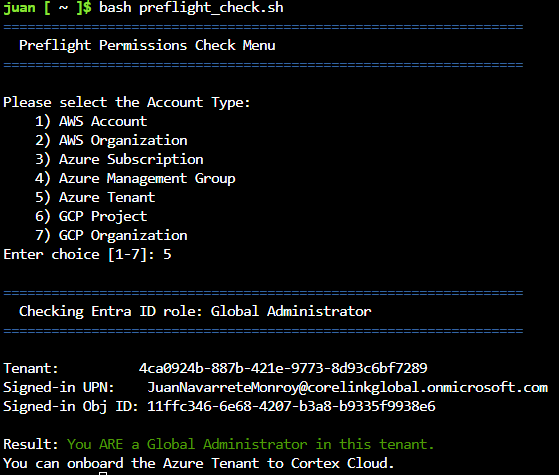

### Failed examples
#### AWS Account - Failed Preflight permissions Check
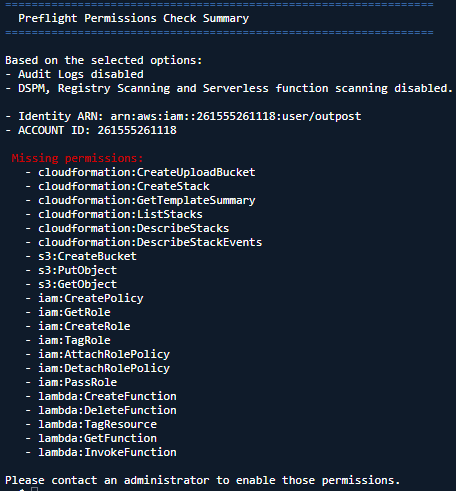

#### AWS Org - Failed Preflight Permissions Check


#### GCP Project - Failed Preflight Permissions Check
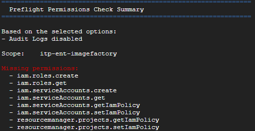

#### GCP Organizations - Failed Preflight Permissions Check
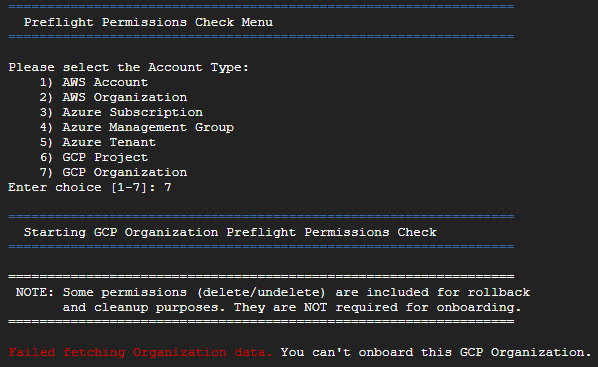

#### Azure Subscriptions - Failed Preflight Permissions Check
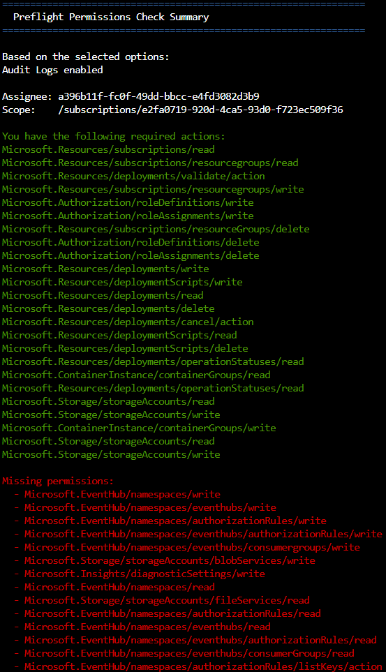

#### Azure Management Group - Failed Preflight Permissions Check
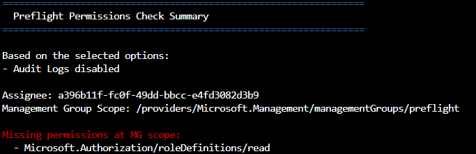

#### Azure Tenant - Failed Preflight Permissions Check
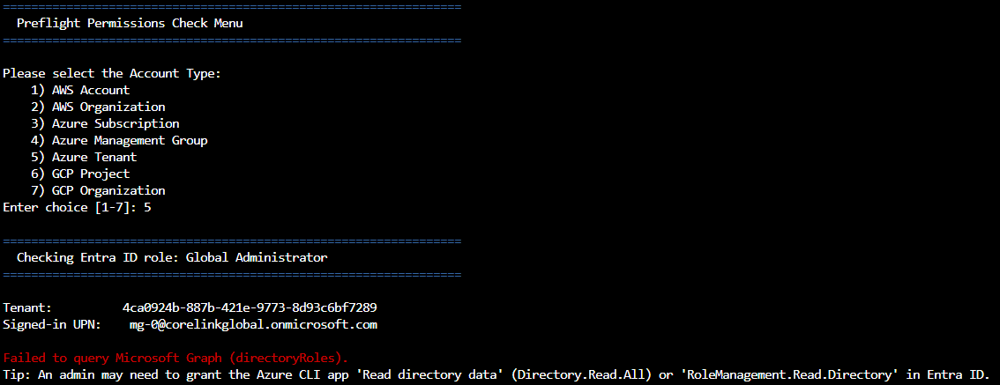

## Troubleshooting

### GCP: Org Policy blocks external members
Errors referencing constraints/iam.allowedPolicyMemberDomains mean your org restricts which identity domains can be added to IAM. Temporarily relax or include the required domains for onboarding.

### AWS: Simulation differs from previous success
Verify you are testing the same principal (assumed role vs user) as the one that deployed successfully.

## Security Notes

- The script does not create or modify resources.
- It reads IAM/role metadata and calls provider permission-testing APIs.
- Review and tailor the permission bundles in the script for your environment.

## Appendix: Handy Commands

- AWS identity: aws sts get-caller-identity
- Switch Azure subscription: az account set --subscription "<SUB_ID>"
- Set GCP project: gcloud config set project <PROJECT_ID>
- List GCP orgs: gcloud organizations list
